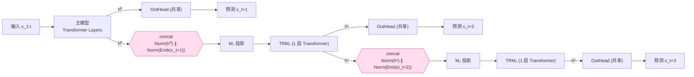
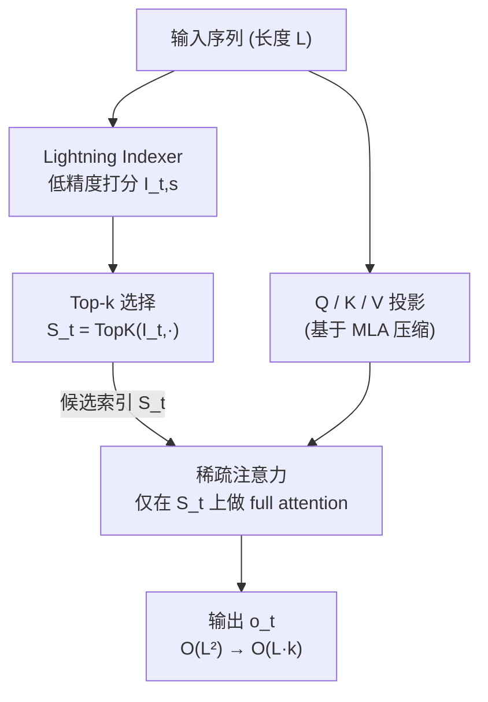

# Multi-Token Prediction 与 DeepSeek Sparse Attention 技术详解

> 本文系统介绍 DeepSeek 系列模型中的两项关键技术：
> **Multi-Token Prediction (MTP)** 与 **DeepSeek Sparse Attention (DSA)**，
> 包含数学推导、结构图与工程实现要点。

---

## 目录

1. [Multi-Token Prediction (MTP)](#一multi-token-prediction-mtp)
   - 1.1 背景与动机
   - 1.2 Meta FAIR 的原始思路
   - 1.3 DeepSeek-V3 的改进：保持因果链的递进式预测
   - 1.4 数学形式化
   - 1.5 结构图
   - 1.6 训练目标与推理加速
2. [DeepSeek Sparse Attention (DSA)](#二deepseek-sparse-attention-dsa)
   - 2.1 背景：注意力的 O(L²) 瓶颈
   - 2.2 与 MLA 的关系
   - 2.3 Lightning Indexer 与 Top-k 选择
   - 2.4 数学形式化
   - 2.5 结构图
   - 2.6 复杂度分析

---

## 一、Multi-Token Prediction (MTP)

### 1.1 背景与动机

标准的自回归语言模型在训练时只做 **next-token prediction**：给定前缀 $x_{1:t}$，最大化下一个 token 的对数似然

$$
\mathcal{L}_{\text{NTP}} = -\sum_{t} \log P_\theta(x_{t+1} \mid x_{1:t}).
$$

这种做法每个位置只提供「一步」的监督信号，存在两个局限：

- **信号稀疏**：模型只被要求关心紧邻的下一个 token，对更长程的规划能力训练不足。
- **推理串行**：生成时一次只能吐一个 token，解码速度受限。

**Multi-Token Prediction** 的核心思想是：在每个位置同时预测 **未来多个 token**，让训练信号更稠密，同时为推理阶段的并行/投机解码创造条件。

---

### 1.2 Meta FAIR 的原始思路

Meta FAIR 团队在论文
**《Better & Faster Large Language Models via Multi-token Prediction》(2024)**
中提出：在共享主干（trunk）之上接 $n$ 个**独立且并行**的输出头(output heads)，每个头负责预测未来第 $k$ 个 token。

形式上，给定共享表示 $z_t = f_{\text{trunk}}(x_{1:t})$，

$$
P(x_{t+k} \mid x_{1:t}) = \text{Head}_k(z_t), \quad k = 1, 2, \dots, n.
$$

训练损失为各头的交叉熵之和：

$$
\mathcal{L}_{\text{MTP}}^{\text{FAIR}} = -\sum_{t}\sum_{k=1}^{n} \log P(x_{t+k}\mid x_{1:t}).
$$

```
            ┌─────────────────────────────────────┐
            │        Shared Transformer Trunk      │
            │              f_trunk(x_1:t) = z_t     │
            └───────────────────┬─────────────────┘
                                │ z_t
        ┌──────────┬────────────┼────────────┬──────────┐
        ▼          ▼            ▼             ▼          ▼
     Head_1     Head_2       Head_3        ...        Head_n
   pred x_{t+1} pred x_{t+2} pred x_{t+3}            pred x_{t+n}
        │          │            │             │          │
       并行预测（各头之间相互独立，无因果依赖）
```

**特点**：各个头**并行**输出，彼此之间没有因果依赖——预测 $x_{t+2}$ 时并不显式条件于「已经预测出的 $x_{t+1}$」。这实现简单、并行度高，但牺牲了未来 token 之间的因果一致性。

---

### 1.3 DeepSeek-V3 的改进：保持因果链的递进式预测

> ⭐ **关键区别（重点）**
>
> **DeepSeek-V3 借鉴了 Meta FAIR 团队论文
> 《Better & Faster Large Language Models via Multi-token Prediction》中的思路，
> 但在实现上有明显不同：它并不是直接并行预测多个 token，
> 而是保持完整的因果链(causal chain)，以逐层递进(sequential / step-by-step)的方式预测未来 token。**

具体来说，DeepSeek-V3 不再用「多个并行独立头」，而是堆叠 $D$ 个**串行的 MTP 模块(MTP Modules)**。第 $k$ 个模块在预测未来第 $k$ 个 token 时，会**显式利用前一个模块对第 $k-1$ 个 token 的预测表示**，从而维持 $x_{t+1} \to x_{t+2} \to \dots$ 的因果链条。

直观对比：

| 维度 | Meta FAIR | DeepSeek-V3 |
|------|-----------|-------------|
| 结构 | 并行的多个输出头 | 串行堆叠的 MTP 模块 |
| 因果链 | 各头独立，无因果依赖 | **完整保留因果链，逐级递进** |
| 第 k 个预测条件 | 仅条件于 $z_t$ | 条件于 $z_t$ **及前序模块的预测表示** |
| Embedding/输出头 | 各头独立 | **与主模型共享** embedding 与 output head |
| 额外参数 | 多个完整头 | 每模块仅一个 Transformer block，开销小 |

---

### 1.4 数学形式化（DeepSeek-V3 版本）

设主模型在位置 $i$ 输出隐藏表示 $\mathbf{h}_i^{0} \in \mathbb{R}^{d}$（主分支的最后一层表示）。共享的 embedding 记为 $\text{Emb}(\cdot)$，共享的输出头记为 $\text{OutHead}(\cdot)$，RMSNorm 记为 $\text{Norm}(\cdot)$。

对于第 $k$ 个 MTP 模块（$k = 1, \dots, D$），其在位置 $i$ 的计算如下：

**第 1 步：拼接前一深度的表示与「真实未来 token」的 embedding**

$$
\mathbf{h}_i^{\prime k}
= M_k \,
\Big[\;
\text{Norm}\big(\mathbf{h}_i^{k-1}\big)
\;\Vert\;
\text{Norm}\big(\text{Emb}(x_{i+k})\big)
\;\Big]
$$

其中：
- $[\,\cdot \Vert \cdot\,]$ 表示在特征维度上拼接(concatenation)；
- $M_k \in \mathbb{R}^{d \times 2d}$ 是该模块的投影矩阵，把 $2d$ 维压回 $d$ 维；
- $\mathbf{h}_i^{k-1}$ 是**前一个模块**（深度 $k-1$）的输出表示，$\mathbf{h}_i^{0}$ 即主模型表示——**这一项正是“因果链/递进”的体现**。

**第 2 步：经过该模块自己的 Transformer block**

$$
\mathbf{h}_{1:T-k}^{k}
= \text{TRM}_k\big(\mathbf{h}_{1:T-k}^{\prime k}\big)
$$

$\text{TRM}_k$ 是第 $k$ 个 MTP 模块专属的一层 Transformer（含注意力 + FFN）。注意序列长度随深度 $k$ 增加而缩短（因为要对齐到更远的未来 token）。

**第 3 步：用共享输出头预测第 $i+k+1$ 个 token**

$$
P_i^{k}\big(x_{i+k+1}\big) = \text{OutHead}\big(\mathbf{h}_i^{k}\big)
= \text{Softmax}\big(W_{\text{out}}\, \mathbf{h}_i^{k}\big)
$$

**训练损失**：每个深度 $k$ 计算一个交叉熵损失，再加权求和

$$
\mathcal{L}_{\text{MTP}}^{k}
= -\frac{1}{T}\sum_{i} \log P_i^{k}\big(x_{i+k+1}\big),
\qquad
\mathcal{L}_{\text{MTP}}
= \frac{\lambda}{D}\sum_{k=1}^{D} \mathcal{L}_{\text{MTP}}^{k}.
$$

总损失为主模型的 next-token 损失加上 MTP 辅助损失：

$$
\mathcal{L} = \mathcal{L}_{\text{main}} + \mathcal{L}_{\text{MTP}},
$$

其中 $\lambda$ 是加权系数（DeepSeek-V3 中按训练阶段调整，例如前期较大、后期衰减）。

---

### 1.5 结构图（DeepSeek-V3 递进式 MTP）

```
   主模型 (Main Model)                MTP Module 1            MTP Module 2
 ┌──────────────────┐            ┌──────────────────┐    ┌──────────────────┐
 │   Transformer    │            │  Transformer×1   │    │  Transformer×1   │
 │     Layers       │            │     (TRM_1)      │    │     (TRM_2)      │
 └────────┬─────────┘            └────────┬─────────┘    └────────┬─────────┘
          │ h^0                           │ h^1                   │ h^2
          ▼                               ▼                       ▼
   ┌────────────┐                  ┌────────────┐          ┌────────────┐
   │ OutHead(共享)│                  │OutHead(共享) │          │OutHead(共享) │
   └─────┬──────┘                  └─────┬──────┘          └─────┬──────┘
         ▼                               ▼                       ▼
     预测 x_{t+1}                     预测 x_{t+2}             预测 x_{t+3}
                                         ▲                       ▲
   因果链(causal chain):                 │                       │
   h^0 ──concat[Emb(x_{t+1})]──► h'^1 ──TRM_1──► h^1 ──concat[Emb(x_{t+2})]──► h'^2 ──TRM_2──► h^2
        └──── 模块1 用到主模型表示 ────┘            └──── 模块2 用到模块1表示 ────┘

   ⭐ 每一级都依赖前一级的输出表示 → 完整保留因果依赖，逐层递进预测更远的未来 token
   ⭐ Emb(·) 与 OutHead(·) 在所有模块间共享，参数开销小
```

与 Meta 并行结构对比示意：

```
   Meta FAIR (并行)                        DeepSeek-V3 (递进/串行)

        z_t                                   h^0
       ┌─┼─┬─┐                                 │
       ▼ ▼ ▼ ▼                                 ▼  (+Emb x_{t+1})
     H1 H2 H3 H4        vs.                    h^1
     (互相独立)                                 │
                                               ▼  (+Emb x_{t+2})
                                               h^2
                                               │
                                               ▼  (+Emb x_{t+3})
                                               h^3
                                          (链式依赖)
```

---

### 1.6 训练收益与推理加速

**训练阶段**
- 每个 token 位置获得 $D+1$ 个监督信号（主头 + $D$ 个 MTP 头），训练信号更稠密、数据效率更高。
- 因为保留因果链，模型被迫学习「连贯地规划未来若干 token」，提升长程一致性。
- 推理时**可以直接丢弃 MTP 模块**，主模型本身的质量已经因 MTP 训练而提升——这是「免费的午餐」。

**推理阶段（可选）**
- 保留 MTP 模块即可做 **投机解码 (speculative decoding)**：MTP 模块一次性提出多个候选 token，主模型并行验证、接受/回退，从而在不损失分布的前提下提高吞吐。
- DeepSeek-V3 报告其第二个 token 的预测接受率较高，可带来显著的端到端加速。

---

## 二、DeepSeek Sparse Attention (DSA)

### 2.1 背景：注意力的 O(L²) 瓶颈

标准多头注意力对长度为 $L$ 的序列，计算复杂度与显存均为 $O(L^2)$：

$$
\text{Attn}(Q,K,V) = \text{Softmax}\!\left(\frac{QK^\top}{\sqrt{d_k}}\right) V,
\qquad QK^\top \in \mathbb{R}^{L \times L}.
$$

当上下文长度达到数万乃至十几万 token 时，这一项成为训练与推理的主要开销。**DeepSeek Sparse Attention** 由 **DeepSeek-V3.2-Exp**(2025 年 9 月)引入，目标是把注意力的有效复杂度从 $O(L^2)$ 降到近似 $O(Lk)$（$k \ll L$）。

核心思想：**对每个 query，只让它关注最相关的 top-k 个 token，而不是全部历史 token。**

---

### 2.2 与 MLA 的关系

DeepSeek 已有的 **MLA (Multi-head Latent Attention)** 通过低秩潜在压缩(low-rank latent compression)来**缩小 KV cache 的显存占用**。DSA 解决的是**另一个维度**的瓶颈——**计算量**：

| 技术 | 解决的瓶颈 | 手段 |
|------|-----------|------|
| MLA | KV cache **显存** | 低秩压缩潜在向量 |
| DSA | 注意力 **计算量 (O(L²))** | top-k 稀疏选择 token |

DSA 构建在 MLA 之上，二者正交互补：MLA 省显存，DSA 省计算。

---

### 2.3 Lightning Indexer 与 Top-k 选择

DSA 包含两个关键组件：

**(1) Lightning Indexer（闪电索引器）**
一个轻量级打分模块，快速估计 query token $t$ 对每个历史 token $s$ 的「相关度」$I_{t,s}$。它用**很低的成本**（较少的头数、低精度如 FP8/BF16、小维度）来计算，不必和主注意力一样精确：

$$
I_{t,s} = \sum_{j=1}^{H_I} w_{t,j}\cdot \phi\!\big(\, q_{t,j}^{I}\cdot k_{s,j}^{I}\,\big)
$$

其中 $H_I$ 是索引器的头数（远小于主注意力头数），$q^I, k^I$ 是索引器专用的轻量 query/key 投影，$\phi$ 为激活（如 ReLU），$w_{t,j}$ 为可学习权重。其计算量相对主注意力可忽略。

**(2) Top-k 细粒度选择 + 稀疏注意力**
对每个 query $t$，根据索引分数选出得分最高的 $k$ 个历史 token，构成候选集合

$$
\mathcal{S}_t = \text{Top-}k\big(\{ I_{t,s} : s \le t \}\big), \qquad |\mathcal{S}_t| = k.
$$

随后**仅在 $\mathcal{S}_t$ 上**做真正(full-precision)的注意力：

$$
\text{DSA}(Q,K,V)_t
= \sum_{s \in \mathcal{S}_t}
\frac{\exp\!\big(q_t \cdot k_s / \sqrt{d_k}\big)}
     {\sum_{s' \in \mathcal{S}_t}\exp\!\big(q_t \cdot k_{s'} / \sqrt{d_k}\big)}
\, v_s.
$$

---

### 2.4 数学形式化与复杂度

**标准注意力**（对所有 $s \le t$ 求和）：

$$
o_t = \sum_{s \le t} \alpha_{t,s}\, v_s,
\qquad
\alpha_{t,s} = \frac{\exp(q_t\cdot k_s/\sqrt{d_k})}{\sum_{s'\le t}\exp(q_t\cdot k_{s'}/\sqrt{d_k})}.
$$

**DSA**：把求和范围从「全部 $s\le t$」替换为「索引器选出的 $\mathcal{S}_t$」：

$$
o_t = \sum_{s \in \mathcal{S}_t} \alpha_{t,s}\, v_s,
\qquad |\mathcal{S}_t| = k \ll L.
$$

**复杂度对比**：

$$
\underbrace{O(L^2 d)}_{\text{标准注意力}}
\;\longrightarrow\;
\underbrace{O(L^2 d_I)}_{\text{Lightning Indexer，}d_I\ll d}
+ \underbrace{O(L\,k\,d)}_{\text{稀疏主注意力}}.
$$

虽然索引器本身仍是 $O(L^2)$ 级别的打分，但它用极小的 $d_I$（低维 + 低精度），常数远小于主注意力；而真正昂贵的全精度注意力被压到 $O(Lk)$。当 $k$ 固定（如 2048）而 $L$ 很大时，整体接近**线性**扩展。

---

### 2.5 结构图

```
                          输入序列 (长度 L)
                                │
                ┌───────────────┴────────────────┐
                ▼                                 ▼
     ┌────────────────────┐             ┌────────────────────┐
     │  Lightning Indexer │             │   Q / K / V 投影     │
     │ (轻量、低精度打分)   │             │   (基于 MLA 压缩)    │
     │  I_{t,s} for all s │             └─────────┬──────────┘
     └─────────┬──────────┘                       │
               │ 相关度分数                         │
               ▼                                   │
     ┌────────────────────┐                        │
     │  Top-k 选择          │                        │
     │  S_t = TopK(I_{t,·})│                        │
     │  每个 query 选 k 个   │                        │
     └─────────┬──────────┘                        │
               │ 候选索引 S_t                        │
               ▼                                     ▼
          ┌──────────────────────────────────────────────┐
          │     稀疏注意力 (仅在 S_t 上做 full attention)    │
          │   o_t = Σ_{s∈S_t} softmax(q_t·k_s) v_s         │
          └───────────────────────┬──────────────────────┘
                                   ▼
                                输出 o_t

   计算量: 全精度注意力从 O(L²) → O(L·k)，k ≪ L
   显存:  KV cache 由底层 MLA 低秩压缩 → 二者正交互补
```

稀疏模式直观示意（每个 query 只点亮 k 个 key）：

```
            key →   s1  s2  s3  s4  s5  s6  s7  s8
   query t1        [■]  ·   ·  [■]  ·   ·   ·   ·     ← 只关注 top-k 个
   query t2         ·  [■] [■]  ·   ·   ·   ·   ·
   query t3        [■]  ·   ·   ·  [■]  ·   ·   ·
   query t4         ·   ·  [■]  ·   ·  [■] [■]  ·
                   （■ = 被 Lightning Indexer 选中，参与注意力）
                   （· = 跳过，不计算）
```

---

### 2.6 效果与意义

- **成本**：在长上下文(例如 128K)训练与推理中，显著降低注意力的计算开销，使长序列处理更经济。
- **质量**：因为索引器经过训练去逼近「真正重要的 token」，DSA 在大幅降本的同时基本保持模型质量。
- **可扩展性**：固定 $k$ 时，长度 $L$ 增长带来的主注意力成本近似线性，为更长上下文打开空间。

---

## 三、小结

| | Multi-Token Prediction (MTP) | DeepSeek Sparse Attention (DSA) |
|---|---|---|
| 解决的问题 | 训练信号稀疏 + 推理串行 | 注意力 O(L²) 计算瓶颈 |
| 核心手段 | 预测未来多个 token | 每个 query 只关注 top-k token |
| DeepSeek 特色 | **保持因果链的递进式预测**（区别于 Meta 的并行多头） | Lightning Indexer + top-k 稀疏，建立在 MLA 之上 |
| 首次落地 | DeepSeek-V3 | DeepSeek-V3.2-Exp |
| 主要收益 | 表示更强、可投机解码加速 | 长上下文降本、近线性扩展 |

> **MTP 一句话**：DeepSeek-V3 借鉴 Meta FAIR《Better & Faster Large Language Models via Multi-token Prediction》的思路，
> 但**不是并行预测多个 token，而是保持完整因果链、逐层递进地预测未来 token**。
>
> **DSA 一句话**：用轻量的 Lightning Indexer 为每个 query 挑出最相关的 top-k token，
> 只在这些 token 上做注意力，把 O(L²) 降到近似 O(L·k)，与 MLA 的显存优化正交互补。

---

## 四、Mermaid 结构图（可在 GitHub / Obsidian 直接渲染）

### 4.1 DeepSeek-V3 递进式 MTP



> 红色节点 `concat` 是**因果链的关键**：每一级都把上一级输出表示 `h^{k-1}` 与真实未来 token 的 embedding 拼接后再前向——逐层递进，而非并行。

### 4.2 DeepSeek Sparse Attention 数据流



---

## 五、与其他方案的横向对比

### 5.1 MTP vs 经典投机解码 (Speculative Decoding)

| 维度 | 经典投机解码 | DeepSeek-V3 MTP |
|------|-------------|-----------------|
| 草稿来源 | 独立的小 draft 模型 | 主模型自带的 MTP 模块 |
| 额外训练 | 需单独训练/对齐 draft 模型 | 与主模型联合训练，天然对齐 |
| 训练副作用 | 无（纯推理技巧） | **同时提升主模型表示质量** |
| 部署成本 | 多维护一个模型 | 复用主干，仅多一层 Transformer |
| 接受率 | 取决于 draft 与主模型分布差异 | 因共享主干，分布天然接近、接受率高 |

> 关键点：MTP 是「训练目标」，投机解码是「推理用法」。DeepSeek 把二者合一——**用同一套 MTP 模块既改善训练、又服务推理加速**。

### 5.2 DSA vs 其他稀疏注意力 (NSA / MoBA)

| 方案 | 稀疏粒度 | 选择方式 | 特点 |
|------|---------|---------|------|
| **NSA**(Native Sparse Attention) | 块(block)级 | 压缩 + 选择 + 滑窗 三分支 | 原生可训练、硬件对齐，三条注意力路径融合 |
| **MoBA**(Mixture of Block Attention) | 块级 | 类 MoE 门控选块 | 把「选哪些块」当作路由问题，灵活切换全/稀疏 |
| **DSA**(DeepSeek Sparse Attention) | **token(细粒度)** | Lightning Indexer 打分 + top-k | 细粒度选 token；建立在 MLA 之上，索引器极轻量 |

要点：
- **NSA / MoBA** 偏向**块级**稀疏(一次选一整块连续 token)，对硬件更友好但粒度较粗；
- **DSA** 做**细粒度 token 级**选择，理论上更精准地保留「真正重要的 token」，代价是需要 Lightning Indexer 这样高效的打分器来承担 token 级排序。

---

## 六、参考伪代码

### 6.1 MTP 前向（递进式，PyTorch 风格）

```python
def mtp_forward(x, main_model, mtp_modules, emb, out_head, norm, D, targets):
    """
    x        : 输入 token ids,  [B, T]
    mtp_modules[k] : 第 k 个 MTP 模块, 含投影 M_k 与一层 Transformer TRM_k
    emb, out_head  : 与主模型【共享】的 embedding 与输出头
    """
    h = main_model(x)                 # h^0 : [B, T, d]  主分支表示
    losses = [cross_entropy(out_head(h), targets[:, 1:])]   # 主头: 预测 x_{t+1}

    for k in range(1, D + 1):
        # 真实未来第 k 个 token 的 embedding（训练时 teacher forcing）
        fut = emb(x[:, k:])                                  # Emb(x_{t+k})
        h_prev = h[:, :fut.shape[1]]                         # 对齐长度
        # ⭐ 因果链：拼接【上一级表示】与【未来 token embedding】
        cat = torch.cat([norm(h_prev), norm(fut)], dim=-1)   # [B, T-k, 2d]
        h = mtp_modules[k].proj(cat)                         # M_k : 2d -> d
        h = mtp_modules[k].trm(h)                            # TRM_k 一层 Transformer => h^k
        logits = out_head(h)                                 # 共享输出头
        losses.append(cross_entropy(logits, targets[:, k+1:]))

    loss = losses[0] + (lam / D) * sum(losses[1:])           # 主损失 + 加权 MTP 损失
    return loss
```

### 6.2 DSA 注意力（top-k 稀疏）

```python
def deepseek_sparse_attention(q, k, v, indexer, topk):
    """
    q, k, v : [B, H, L, d]   (k/v 来自 MLA 解压)
    indexer : 轻量打分器, 返回 [B, L, L] 的相关度分数 (低精度)
    topk    : 每个 query 保留的 token 数 k (≪ L)
    """
    scores_idx = indexer(q, k)                       # I_{t,s}, 低成本打分
    scores_idx = apply_causal_mask(scores_idx)       # 只看 s <= t
    sel = scores_idx.topk(topk, dim=-1).indices      # S_t : [B, L, topk]

    k_sel = gather(k, sel)                            # 仅取选中的 key
    v_sel = gather(v, sel)                            # 仅取选中的 value
    attn  = (q.unsqueeze(-2) * k_sel).sum(-1) / d**0.5
    attn  = attn.softmax(dim=-1)                     # 仅在 S_t 上归一化
    out   = (attn.unsqueeze(-1) * v_sel).sum(-2)     # O(L·k) 而非 O(L²)
    return out
```

> 注:以上为说明性伪代码,旨在体现**算法骨架**(MTP 的因果链拼接、DSA 的 top-k gather),实际工程实现会融合 kernel、低精度、KV cache 等优化。
